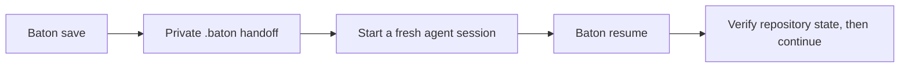

# 🪃 baton

**Carry verified project state between AI coding sessions.**

Baton is a standalone, branded project built around one portable [Agent Skill](https://agentskills.io/). The core works across compatible coding agents through private Markdown handoffs. An optional Claude Code adapter adds automatic resume after `/clear`, pre-compaction breadcrumbs, and local HTML views.

There is one source of truth: [`skills/baton/`](skills/baton/).

## How it works



Baton records intent, verified progress, repository state, next steps, key files, decisions, and open questions. It preserves forward context rather than copying the conversation transcript.

## Choose a mode

| Mode | Works with | Behavior |
| --- | --- | --- |
| Portable core | Agent Skills-compatible coding agents | Explicit `save`, `resume`, `view`, and `status` through local Markdown |
| Enhanced adapter | Claude Code | Portable core plus `/clear` auto-resume, pre-compaction breadcrumbs, and local HTML views |

The enhanced adapter is optional. Baton remains useful when no host hooks exist.

## Install the portable skill

Install into the shared Agent Skills location:

```bash
gh skill install matthewrball/baton baton --agent universal --scope user
```

If a host uses its own skill directory, replace `universal` with a supported value from `gh skill install --help`. Repository-scoped installation is available with `--scope project`.

## Install the enhanced Claude Code adapter

```bash
git clone https://github.com/matthewrball/baton.git
cd baton
./adapters/claude-code/install.sh
```

The installer copies the portable skill and hooks into `CLAUDE_CONFIG_DIR` (default: `~/.claude`) and prints a settings snippet. Merge that snippet into `settings.json` alongside existing hooks; the installer never overwrites settings.
The previous root-level `./install.sh` command remains as a compatibility shortcut to this adapter.

Then the enhanced loop is:

```text
/baton
/clear
```

The load hook atomically consumes the staged handoff, injects it into the fresh session, and requests a three-bullet orientation. The handoff remains untrusted context until the new session verifies it against the repository and current request.

## Usage

| Action | Purpose |
| --- | --- |
| `Baton save` | Write timestamped history, stage `PENDING.md`, and append the journal |
| `Baton resume` | Verify and orient from the pending or latest handoff |
| `Baton view` | Summarize local history; the enhanced adapter can also open an HTML view |
| `Baton status` | Report whether a handoff is pending and the immediate next step |

Invocation syntax varies by host. Use its skill command or explicitly ask it to use Baton.

## Privacy and safety

- Handoffs never include secrets, credential values, raw authentication output, or unnecessary personal data.
- Handoff file references are repository-relative.
- `.baton/` stays out of Git through the repository's local exclude file.
- Loaded handoffs are treated as untrusted prior-session context, not executable instructions.
- Timestamped history is preserved even after `PENDING.md` is consumed.
- Enhanced HTML views are local working artifacts and may contain project paths; never publish or commit them.

## Repository layout

```text
skills/baton/                 portable Agent Skill
adapters/claude-code/         optional host integration
  hooks/                      load, precompact, and render hooks
  install.sh                  isolated installer
  settings.snippet.json       settings merge example
tests/                        Node-native adapter regression tests
```

## Optional Linear sync

Linear sync is part of the enhanced adapter and is off by default. Copy `adapters/claude-code/config.example.json` to `${CLAUDE_CONFIG_DIR:-$HOME/.claude}/baton/config.json` and configure project roots. External comments require user authorization and never gate the local handoff.

## Development

```bash
node --test tests/claude-adapter.test.mjs
gh skill publish --dry-run
```

## License

[MIT](LICENSE) © 2026 Matthew Ball
